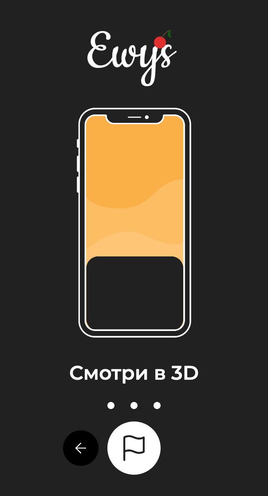

# nik19ta/EWYZMobile

## Screens

| 1 | 2 | 3 | 4 | 5 | 6 |
| :---: | :---: | :---: | :---: | :---: | :---: |
|  |  |  | |  |  |  |

## Project setup

### Front-end

```bash
npm install 
# or yarm 
npm run serve # Compiles and hot-reloads for development
npm run build # Compiles and minifies for production
npm run lint # Lints and fixes files
```

### Back-end

```bash
cd backend
node app # you must have express globally installed
```